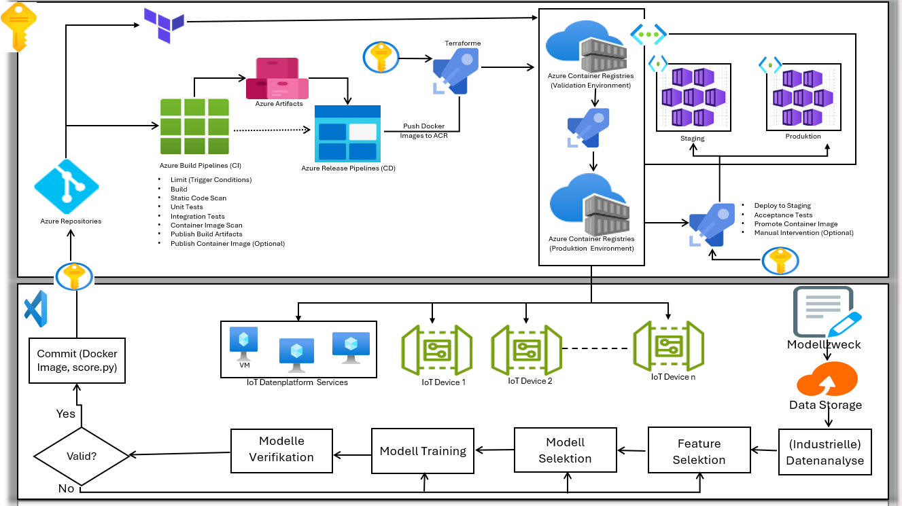

# DevOps-Datenanalyseplattform

Entwicklung einer hochmodernen End-to-End Datenplattform, die Unternehmen dabei unterstützt, ihre digitale Transformation zu beschleunigen und datengesteuerte Entscheidungen in Echtzeit zu treffen.

Geschäftlicher Mehrwert:
- Reduktion der Time-to-Market für neue Features
- Automatisierte Qualitätssicherung mit Zero-Downtime-Deployments
- Echtzeit-IoT-Analytics für prädiktive Wartung und Optimierung
- Skalierbare ML-Pipelines für intelligente Geschäftsentscheidungen
- Enterprise-Security mit kontinuierlichem Vulnerability-Scanning

---

  

---
## Verwendete Tools

###  Entwicklung & Versionierung
- Azure Repositories  
- Visual Studio Code

###  CI/CD & Build
- Azure DevOps  
- Azure Build Pipelines  
- Azure Release Pipelines

###  Qualität & Sicherheit
- SonarQube  
- Trivy  
- Nexus

###  Containerisierung & Orchestrierung
- Docker  
- Kubernetes  
- Azure Container Registry

### Cloud & Infrastruktur
- Azure  
- Azure Container Instances
- Terraform

###  IoT & Daten
- IoT Hub  
- Azure Data Storage  
- Virtual Machines (VM)

###  Machine Learning
- Azure Machine Learning  
- Python  

###  Monitoring & Logs
- Azure Monitor  
- Application Insights

