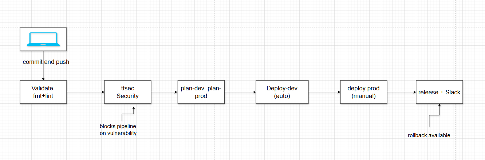

# Monitoring as Code — Kubernetes + Datadog with Terraform

Infrastructure as Code project that deploys a full observability stack on Kubernetes using Terraform, Helm, and Datadog — with a GitLab CI/CD pipeline secured via OIDC (no long-lived credentials).

## CI/CD Pipeline



**Drift detection** runs every morning via a scheduled pipeline — alerts if infrastructure was changed manually outside Terraform.

## Stack

| Tool        | Purpose                                               |
|-------------|-------------------------------------------------------|
| Terraform   | Provision all resources as code                       |
| Kubernetes  | Container orchestration (k3s)                         |
| Helm        | Deploy Datadog Agent chart                            |
| Datadog     | Metrics, logs, APM, and alerting                      |
| GitLab CI   | validate -> tfsec -> plan -> deploy -> release            |
| tfsec       | Static security analysis — blocks pipeline on finding |
| AWS S3      | Remote state storage (encrypted, versioned, locked)   |
| AWS IAM     | OIDC federation — short-lived tokens, no stored keys  |

## Environments

| | dev | prod |
|---|---|---|
| Replicas | 1 | 3 |
| Alert warning | 1 pod | 2 pods |
| Alert critical | 1 pod | 1 pod |
| Deploy | automatic | manual gate |
| Namespace app | `sre-stack-dev` | `sre-stack-prod` |
| Namespace monitoring | `sre-stack-dev-monitoring` | `sre-stack-prod-monitoring` |
| Terraform state | `env:/dev/...` | `env:/prod/...` |
| Branch | `dev` + `main` | `main` only |

## Terraform Resources

| File                          | Description                                                      |
|-------------------------------|------------------------------------------------------------------|
| `backend.tf`                  | S3 remote state — native locking (Terraform >= 1.10)            |
| `versions.tf`                 | Provider constraints — Datadog ~3.30, K8s ~2.20, Helm ~2.12, AWS ~5.0 |
| `variables.tf`                | All variables — secrets marked `sensitive = true`, env validated |
| `datadog.tf`                  | Datadog provider                                                 |
| `resources.tf`                | Kubernetes namespace, deployment, NodePort service               |
| `helm-datadog.tf`             | Kubernetes provider + Datadog Agent via Helm                     |
| `monitors-infrastructure.tf`  | Node CPU, memory, disk, network error monitors                   |
| `monitors-kubernetes.tf`      | Pod count, CrashLoopBackOff, restarts, pending, OOMKilled        |
| `monitors-application.tf`     | HTTP 5xx rate, latency p95, zero traffic detection               |
| `outputs.tf`                  | Active environment, workspace, namespaces, all monitor IDs       |

## What is Monitored

### Datadog Agent data collection

| Collection     | Detail                                          |
|----------------|-------------------------------------------------|
| Logs           | All containers across the cluster               |
| Events         | Kubernetes events (scheduling, eviction, etc.)  |
| NPM            | Network Performance Monitoring between pods     |
| System Probe   | TCP queue length, OOM kill detection            |
| Security Agent | Runtime threat detection                        |
| Cluster Agent  | Metrics server — enables HPA autoscaling        |

### 12 monitors across 3 layers

#### Layer 1 — Infrastructure (`monitors-infrastructure.tf`)

> **Problem:** a saturated node causes pod evictions, scheduling failures, and cascading outages — often before any application metric fires.

| Monitor        | Problem detected                          | Warning      | Critical     |
|----------------|-------------------------------------------|--------------|--------------|
| Node CPU       | Node overloaded — risk of throttling      | > 70%        | > 85%        |
| Node Memory    | Memory pressure — risk of OOMKill         | < 25% free   | < 15% free   |
| Node Disk      | Disk full — kubelet stops scheduling      | > 75%        | > 85%        |
| Network errors | Packet loss — silent service degradation  | > 50/s       | > 100/s      |

#### Layer 2 — Kubernetes (`monitors-kubernetes.tf`)

> **Problem:** Kubernetes hides failures behind restarts and rescheduling — without monitors, a broken pod can loop silently for hours.

| Monitor          | Problem detected                                        | Threshold                      |
|------------------|---------------------------------------------------------|--------------------------------|
| Pod count        | Not enough replicas to handle load                      | env-specific (dev: 1, prod: 3) |
| CrashLoopBackOff | Container fails repeatedly on start                     | 1 occurrence                   |
| Pod restarts     | Instability — possible memory leak or bad config        | > 3 warning / > 5 critical     |
| Pending pods     | Scheduler cannot place pods — resource exhaustion       | 1 pod pending > 10min          |
| OOMKilled        | Container killed by kernel — memory limit too low       | 1 occurrence                   |

#### Layer 3 — Application (`monitors-application.tf`)

> **Problem:** infrastructure can be healthy while the application is silently returning errors or timing out — end users are impacted but no infra alert fires.

| Monitor      | Problem detected                                          | Warning  | Critical      |
|--------------|-----------------------------------------------------------|----------|---------------|
| HTTP 5xx rate | Application errors returned to users                    | > 1%     | > 5%          |
| Latency p95  | Slow responses — SLO breach risk                          | > 500ms  | > 1s          |
| Zero traffic | No requests received — possible outage or misconfigured routing | —  | 0 req / 10min |

All monitors follow the pattern `[ENV] Monitor Name` — e.g. `[PROD] CrashLoopBackOff detected` — so on-call engineers immediately know the impacted environment.

## Prerequisites

- [Terraform](https://developer.hashicorp.com/terraform/install) >= 1.10.0
- [kubectl](https://kubernetes.io/docs/tasks/tools/) configured against a running cluster
- [Helm](https://helm.sh/docs/intro/install/) >= 3.x
- [AWS CLI](https://docs.aws.amazon.com/cli/latest/userguide/install-cliv2.html) configured
- A [Datadog](https://www.datadoghq.com/) account with API key and APP key

## Deployment

### 1. Set up k3s

```bash
curl -sfL https://get.k3s.io | sh -
mkdir -p ~/.kube
sudo cp /etc/rancher/k3s/k3s.yaml ~/.kube/config
sudo chown $USER ~/.kube/config
```

### 2. Bootstrap — run once

Creates the S3 bucket and IAM OIDC role for GitLab CI.

```bash
cd bootstrap/
terraform init
terraform apply
# note the output: gitlab_ci_role_arn
cd ..
```

### 3. GitLab CI/CD Variables

| Variable                  | Value                         | Options            |
|---------------------------|-------------------------------|--------------------|
| `AWS_ROLE_ARN`            | output from bootstrap         | Protected          |
| `TF_VAR_datadog_api_key`  | Datadog API key               | Masked + Protected |
| `TF_VAR_datadog_app_key`  | Datadog APP key               | Masked + Protected |
| `SLACK_WEBHOOK_URL`       | Slack incoming webhook URL    | Masked             |

### 4. Drift detection schedule

GitLab → CI/CD → Schedules → `0 8 * * *` on `main` branch.

### 5. Local deploy (optional)

```bash
helm repo add datadog https://helm.datadoghq.com && helm repo update

export TF_VAR_datadog_api_key="your_api_key"
export TF_VAR_datadog_app_key="your_app_key"

terraform init
terraform workspace select prod
terraform apply -var-file=environments/prod.tfvars
```

## Verify Deployment

```bash
terraform output

kubectl get pods -n sre-stack-dev
kubectl get pods -n sre-stack-prod

kubectl exec -n sre-stack-prod-monitoring \
  $(kubectl get pod -n sre-stack-prod-monitoring -l app=datadog-agent -o name | head -1) \
  -- agent status
```

## Rollback

GitLab → CI/CD -> Pipelines -> last successful pipeline on `main` -> trigger `rollback-prod`.

## Security

| Practice             | Implementation                                          |
|----------------------|---------------------------------------------------------|
| No long-lived AWS credentials | OIDC — GitLab JWT exchanged for 15-min STS token |
| No secrets in code   | `sensitive = true`, `TF_VAR_*` env vars, Masked in GitLab |
| No state in git      | `*.tfstate` in `.gitignore`                             |
| State encrypted      | AES256 on S3                                            |
| State protected      | `prevent_destroy = true` on S3 bucket                  |
| Security scan        | tfsec blocks pipeline on any finding                    |
| Least privilege      | IAM role scoped to S3 bucket + main branch only         |
| Drift detection      | Scheduled pipeline alerts on out-of-band changes        |

## Project Structure

```
.
├── .gitlab-ci.yml                
├── .gitignore                   
├── backend.tf                    
├── versions.tf                  
├── variables.tf                 
├── datadog.tf                    
├── resources.tf                  
├── helm-datadog.tf              
├── monitors-infrastructure.tf    # Node CPU / memory / disk / network (4 monitors)
├── monitors-kubernetes.tf        # Pod health / CrashLoop / restarts / OOM (5 monitors)
├── monitors-application.tf       # HTTP 5xx / latency p95 / zero traffic (3 monitors)
├── outputs.tf                    # Environment, workspace, all monitor IDs
├── environments/
│   ├── dev.tfvars                # Dev: 1 replica, relaxed thresholds
│   └── prod.tfvars               # Prod: 3 replicas, strict thresholds
└── bootstrap/
    ├── main.tf                   ### S3 bucket — versioned, encrypted, public access blocked
    ├── iam-oidc.tf               # ## IAM OIDC provider + role for GitLab CI
    ├── variables.tf              # ## AWS region, GitLab namespace/project
    └── outputs.tf                # ## Bucket name, IAM role ARN
```
