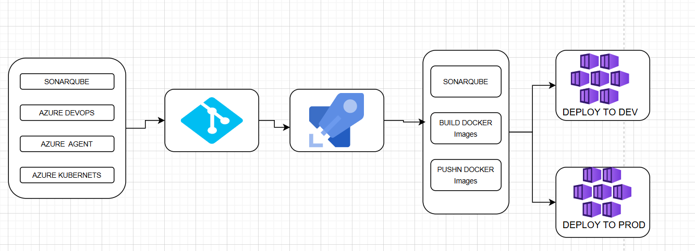
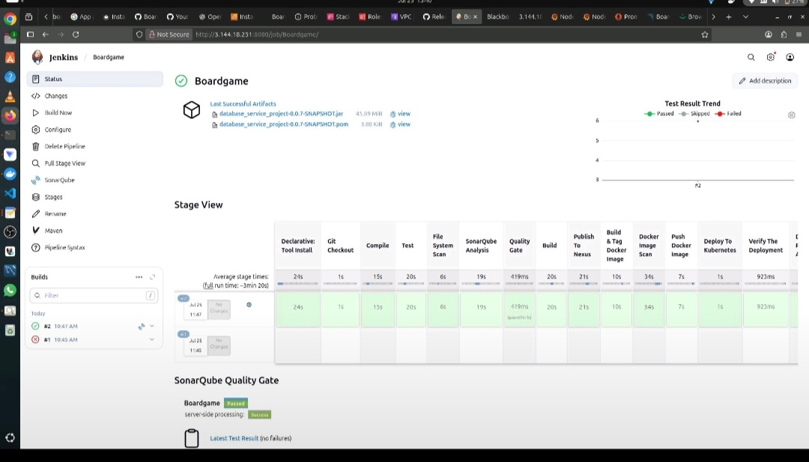

# CI/CD Platform - Jenkins · Kubernetes · AWS

Vollständige CI/CD-Pipeline für eine containerisierte Anwendung - vom Code-Commit bis zum automatischen Produktions-Deployment auf Kubernetes.

**Problem:** Deployments wurden manuell durchgeführt, Builds schlugen regelmäßig fehl (20+ Versuche), kein Qualitäts- oder Sicherheits-Check war integriert.

- Jenkins-Pipeline automatisiert jeden GitHub-Push bis zum Kubernetes-Deployment - kein manueller Eingriff
- Builds von 20+ auf 2 reduziert durch vollständiges Neuschreiben des Jenkinsfile
- SonarQube und Trivy direkt in die Pipeline integriert - Qualität und Sicherheit als Pflichtgates
- Datadog durch Prometheus + Grafana ersetzt und damit Lizenzkosten eliminiert

  

  

  

  

  

