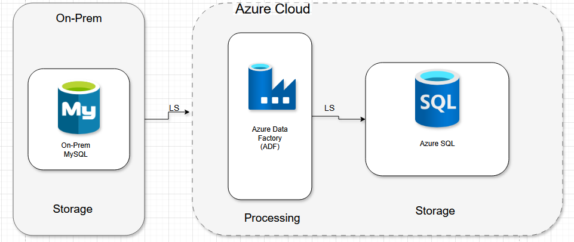
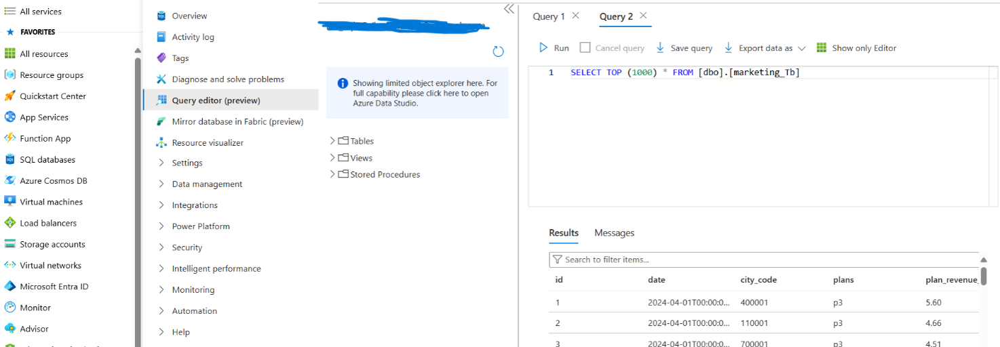
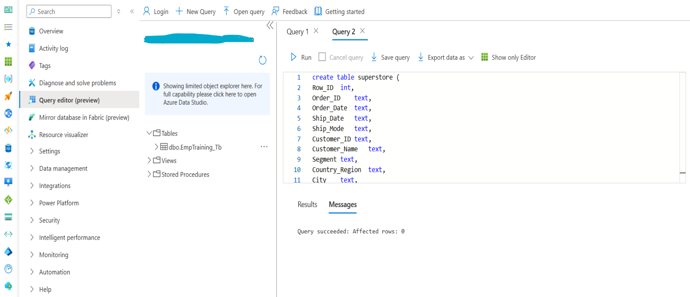
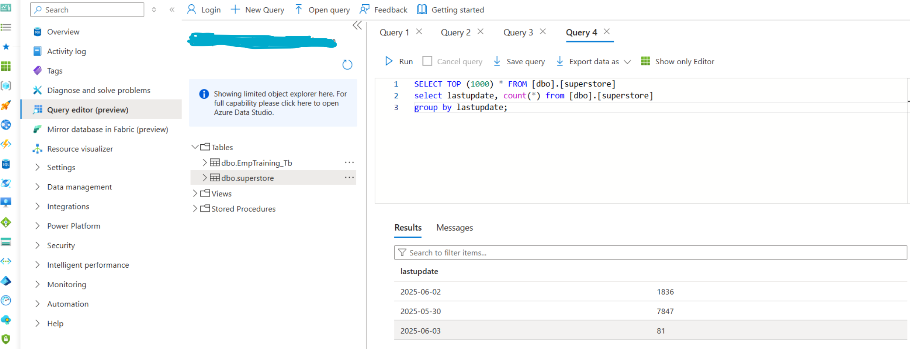

# Migration On-Premises → Azure SQL Database

Migration von MySQL On-Prem nach Azure SQL über Azure Data Factory - Full Load und Incremental Load implementiert.

**Problem:** Geschäftsdaten waren in einer lokalen MySQL-Datenbank gesperrt und für Cloud-Analyse-Tools nicht erreichbar. Eine vollständige Migration sowie regelmäßige Synchronisierungen waren erforderlich.

## Full Load

- On-Prem MySQL über Self-hosted Integration Runtime mit ADF verbunden
- Vollständige Datenkopie nach Azure SQL mit Copy Activity und abschließender Konsistenzprüfung

  

  

## Incremental Load

- Lookup Activity liest `MAX(LastUpdate)` aus Azure SQL - nur neuere Datensätze werden bei jedem Run kopiert
- Übertragungsvolumen und Ausführungszeit gegenüber wiederholtem Full Load deutlich reduziert

  

  

