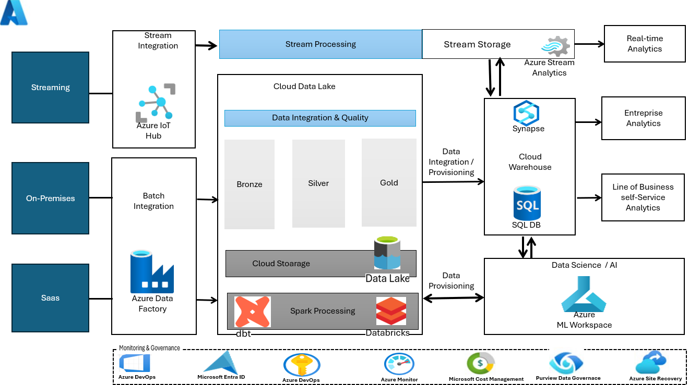
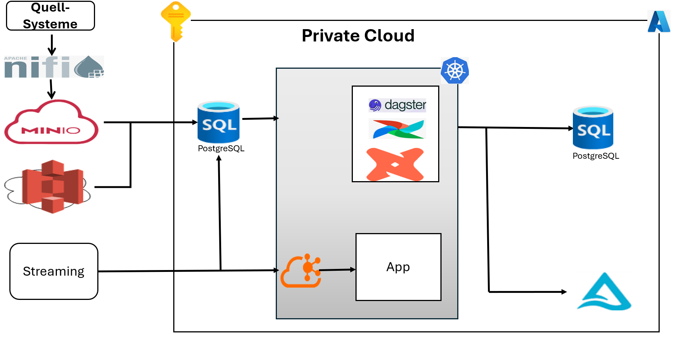
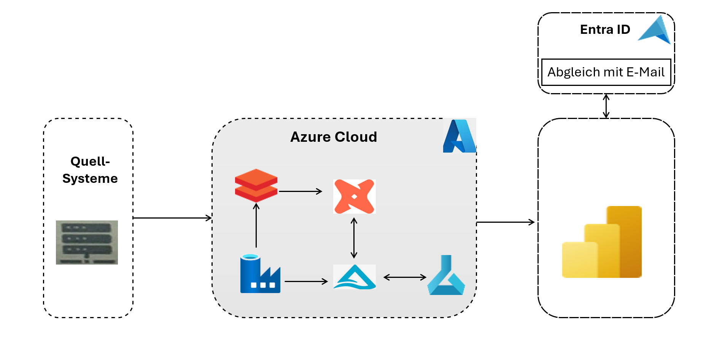
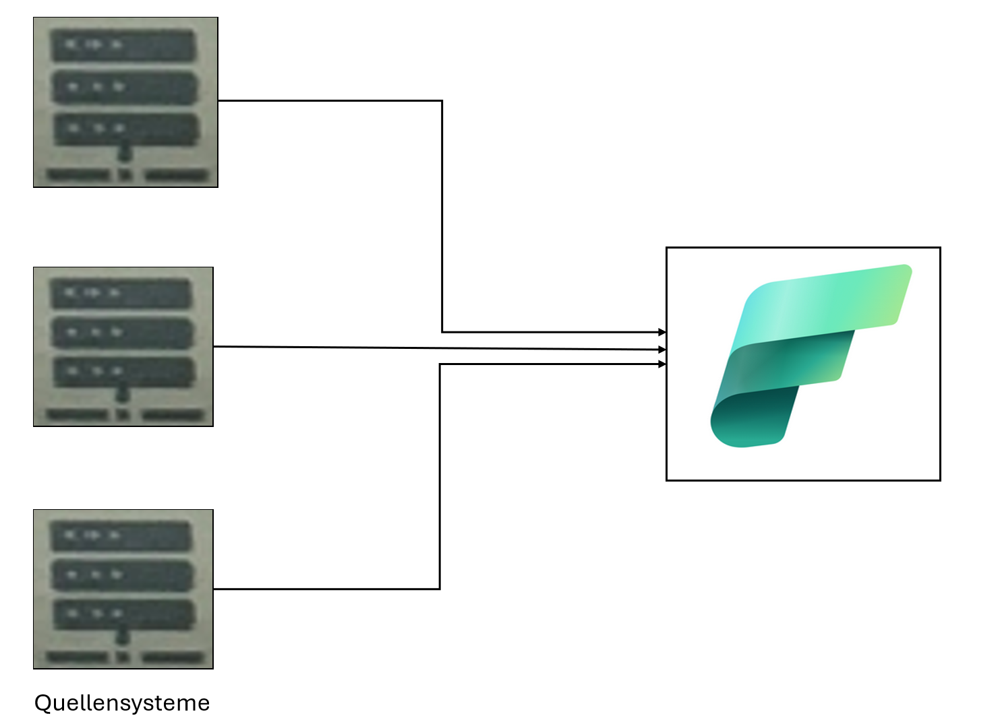
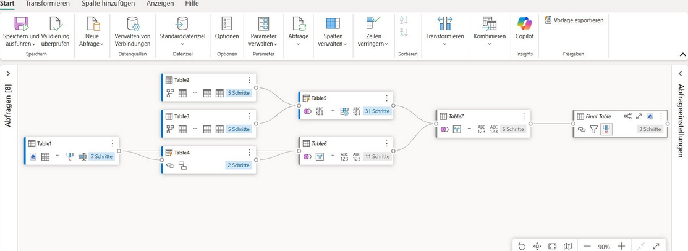

# Moderne Datenplattform - Azure Medallion Architecture

Skalierbare Cloud-Datenarchitektur auf Azure nach dem Medallion-Modell (Bronze → Silver → Gold).

**Problem:** Geschäftsdaten lagen verteilt in heterogenen Quellsystemen (SQL Server, CRM, ERP) - ohne einheitliche Analyseschicht und ohne zuverlässiges Echtzeit-Reporting.

- Extraktion und Laden aus mehreren Quellen über Azure Data Factory orchestriert - mit Delta Loads
- Daten schichtweise transformiert und angereichert mit Databricks + PySpark und Delta Live Tables (Batch + Streaming)
- Star Schema mit dbt modelliert - Fakt- und Dimensionstabellen in Azure Synapse und Power BI bereitgestellt
- Infrastruktur mit Terraform deployt, Zugriff über Azure Key Vault und RBAC abgesichert

  

## Hybrid ETL (Open Source)

Extraktion aus MinIO → spaltenweise Anreicherung → DBT-Transformation → Speicherung in PostgreSQL.

  

## Azure ETL

Quellsysteme → ADF → DBT → Databricks → Azure Data Lake, Authentifizierung über Entra ID, Visualisierung in Power BI.

  

## Microsoft Fabric

Fragmentierte Power BI Workspaces durch zentrales OneLake ersetzt - Transformationslogik einmalig definiert und teamübergreifend wiederverwendet.

  

  

