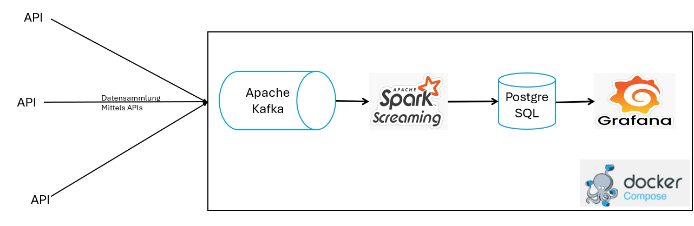
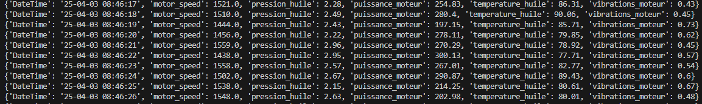
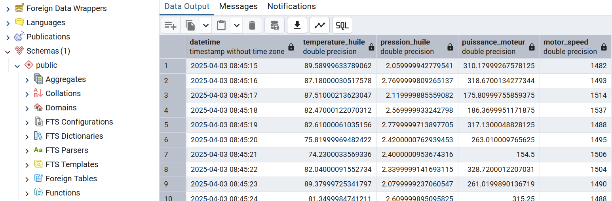
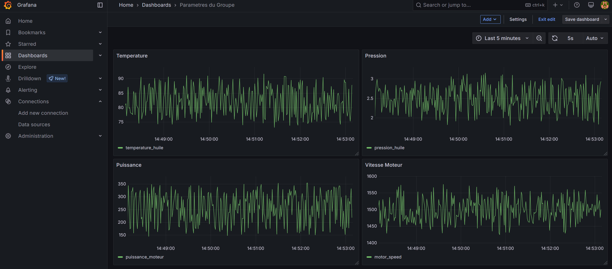

# Open-Source Platform - Echtzeit-Datenverarbeitung

Modulare Data-Engineering-Plattform für Echtzeit-Ingestion, -Verarbeitung und -Visualisierung - ausschließlich Open-Source-Komponenten, containerisiert mit Docker Compose.

**Problem:** Keine Infrastruktur für die Verarbeitung kontinuierlicher Datenströme - Daten wurden mit erheblicher Verzögerung per Batch verarbeitet, ohne Qualitätsprüfung und ohne Monitoring.

- Kafka → Spark Streaming-Pipeline aufgebaut - Latenz auf Echtzeit reduziert
- Pipelines mit Airflow orchestriert und Datenqualität mit Great Expectations validiert
- Transformierte Daten in PostgreSQL gespeichert und in Echtzeit in Grafana visualisiert
- Vollständig cloud-unabhängige Architektur - mit einem Befehl deploybar

  

  

  

  

  

