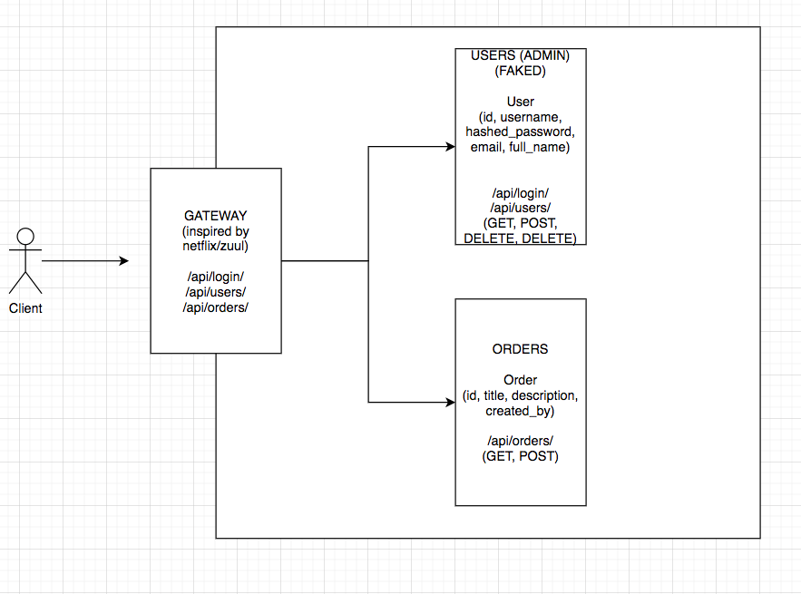
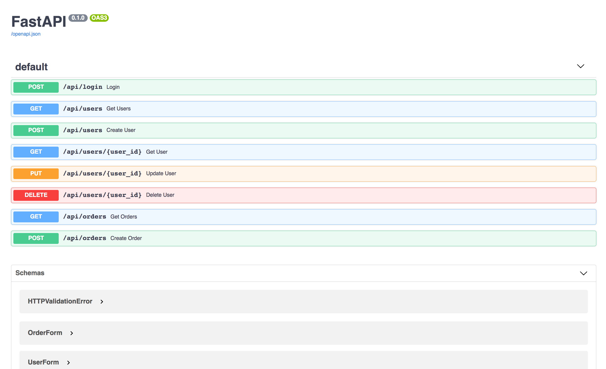

# Microservices CI/CD - Gateway · Orders · Users

Microservice-Architektur mit vollständiger GitLab CI/CD-Pipeline, deployt auf Kubernetes über Helm mit isolierten Umgebungen (dev, staging, qa, prod).

**Problem:** Eine monolithische Anwendung machte Deployments riskant und langsam - jede Änderung erforderte ein vollständiges Redeployment ohne Service-Isolation.

- Anwendung in 3 unabhängige Microservices aufgeteilt (Gateway, Orders, Users) mit eigenem Dockerfile und eigenen Dependencies
- 4 isolierte Kubernetes-Umgebungen über Namespaces und umgebungsspezifische Helm-Values aufgesetzt
- Build, Scan, DockerHub-Push und Kubernetes-Deployment vollständig über GitLab CI/CD automatisiert
- Gateway zentralisiert Authentifizierung und Routing zu den Services Orders und Users

## Architektur

## Pipeline & Dokumentation

## CI/CD Pipeline - Einblick

