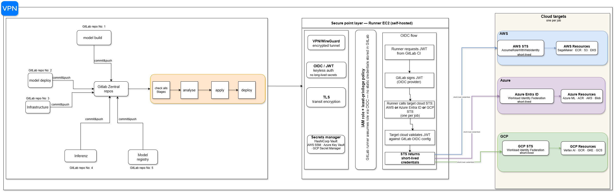

# MLOps Central CI/CD — Multi-Cloud Infrastructure

> A production-grade MLOps platform built to ship models across AWS, Azure and GCP — without storing a single credential, without rotating a single key, and without compromising on security at any layer. Centralized GitLab orchestration, EC2 self-hosted runners, keyless OIDC authentication end to end.

---

## Table of Contents

1. [Overview](#overview)
2. [Architecture](#architecture)
3. [Source Repositories](#source-repositories)
4. [CI Pipeline Stages](#ci-pipeline-stages)
5. [Security Layer](#security-layer)
6. [OIDC Multi-Cloud Authentication](#oidc-multi-cloud-authentication)
7. [Architecture Decisions](#architecture-decisions)
8. [Getting Started](#getting-started)
9. [Incident Response](#incident-response)

---

## Overview

The architecture is organized around a central GitLab repository that acts as the single orchestration point for five independent source repositories. Each repo covers a distinct part of the ML lifecycle — model training and packaging, deployment configuration, inference serving, model versioning, and infrastructure. Every commit from every repo flows into the **GitLab Zentral Repo**, which enforces the same four pipeline gates — `check -> analyse -> apply -> deploy` — regardless of who pushed or which repo triggered the run.

A hardened EC2 self-hosted runner takes over from there — authenticated to AWS, Azure and GCP through **OIDC/JWT**, with no access keys stored anywhere in the system. Every credential expires automatically. Every deployment is auditable down to the GitLab job ID.


---

## Architecture



### Key Design Principles

| Principle | Implementation |
|-----------|---------------|
| No static credentials | OIDC/JWT only — no AWS/Azure/GCP keys stored in GitLab |
| Least-privilege | IAM role scoped per job, not per runner |
| Short-lived credentials | Auto-expiring tokens via STS (~1h) |
| Single source of truth | All repos converge to GitLab Zentral Repo |
| Defense in depth | VPN/WireGuard + TLS + OIDC + IAM + Secrets Manager |
| Multi-cloud portability | One OIDC flow covers AWS, Azure and GCP |

---

## Source Repositories

| Repo | Purpose |
|------|---------|
| `model-build` | Training pipeline, artifact packaging |
| `model-deploy` | Deployment manifests, release configs |
| `infrastructure` | IaC (Terraform/Ansible), cloud resource provisioning |
| `inferenz` | Inference service, model serving layer |
| `model-registry` | Model versioning, metadata, lineage tracking |

Each repo is autonomous and scoped to its own domain. Every commit triggers a push to the Zentral Repo which takes over orchestration.

---

## CI Pipeline Stages

Every change goes through four mandatory gates before reaching production:

```
check all stages -> analyse -> apply -> deploy
```

| Stage | What happens |
|-------|-------------|
| `check` | Linting, YAML validation, policy-as-code (OPA/Conftest) |
| `analyse` | SAST, SCA (dependency CVEs), container image scanning |
| `apply` | Infrastructure provisioning, Terraform plan + apply |
| `deploy` | Model deployment, service rollout to target cloud |

No stage can be skipped — pipeline fails fast and blocks deployment if any gate does not pass.

---

## Security Layer

Security was not an afterthought. I designed the runner environment with five independent layers — compromising one does not compromise the system. Each layer addresses a distinct threat.

```
Layer 1 — VPN/WireGuard       Network-level isolation
Layer 2 — TLS                 Transit encryption for all API calls
Layer 3 — OIDC/JWT            Keyless identity & authentication
Layer 4 — IAM least-privilege Scoped authorization per job
Layer 5 — Secrets Manager     Runtime secret injection, never stored
```

**VPN/WireGuard** — All traffic between the EC2 runner and cloud private resources flows through a WireGuard encrypted tunnel. The runner is not directly exposed to the public internet for resource access.

**TLS** — All API calls (GitLab API, STS endpoints, Secrets Manager) use TLS 1.2+. Complements WireGuard for defense in depth on transit.

**OIDC/JWT** — No static credentials stored anywhere. GitLab signs a JWT per job. The runner exchanges this JWT for short-lived cloud credentials.

**IAM least-privilege** — Each job assumes a role with minimum permissions for that specific task. No wildcard permissions in production. Resource-level restrictions enforced (specific bucket ARN, specific ECR repo, etc.).

**Secrets Manager** — Application-level secrets (DB passwords, API keys) are never in GitLab variables. Fetched at runtime using short-lived OIDC credentials from HashiCorp Vault, AWS SSM, Azure Key Vault, or GCP Secret Manager.

---

## OIDC Multi-Cloud Authentication

### Why OIDC?

The first thing I ruled out was an EC2 Instance Profile. It works fine for AWS — but this platform targets three clouds, and an Instance Profile gives nothing on Azure or GCP. I needed a single authentication mechanism that covers all three without introducing stored credentials.

OIDC was the answer. GitLab acts as the Identity Provider. At job start, it signs a short-lived JWT that identifies the job — which project, which branch, which pipeline. The runner presents that token to the target cloud's STS endpoint, which validates it against GitLab's public OIDC configuration and returns temporary credentials scoped to a specific IAM role. Those credentials expire in about an hour. Nothing is stored. Nothing needs to be rotated manually.

### Flow

```
1. Job starts on EC2 runner
2. Runner requests JWT from GitLab CI
3. GitLab signs the JWT (acts as OIDC provider)
4. Runner calls the target cloud STS with the JWT:
       AWS   -> AssumeRoleWithWebIdentity (AWS STS)
       Azure -> Workload Identity Federation (Azure Entra ID)
       GCP   -> Workload Identity Federation (GCP STS)
5. Target cloud validates JWT against GitLab OIDC config
6. STS returns short-lived credentials (~1h)
7. Job uses credentials — they expire automatically
```

> One job = one cloud. Each job specifies its target cloud via a runtime token request in `.gitlab-ci.yml` — no credential is stored, the token is generated fresh at job start and expires with it.

### Cloud Configuration

No credentials are stored in GitLab. The `id_tokens` block is a pipeline declaration — it tells GitLab to generate and sign a fresh JWT for that specific job. The token is created at runtime, scoped to the job, and exchanged directly with the target cloud STS. Nothing is stored, nothing persists.

| Cloud | Mechanism | Token audience (`aud`) |
|-------|-----------|----------------------|
| AWS | `AssumeRoleWithWebIdentity` | `https://sts.amazonaws.com` |
| Azure | Workload Identity Federation | `api://AzureADTokenExchange` |
| GCP | Workload Identity Federation | `https://iam.googleapis.com/...` |

### `.gitlab-ci.yml` Example

```yaml
deploy-aws:
  stage: deploy
  id_tokens:
    AWS_TOKEN:
      aud: https://sts.amazonaws.com
  script:
    - aws sts assume-role-with-web-identity \
        --role-arn $AWS_ROLE_ARN \
        --web-identity-token $AWS_TOKEN \
        --role-session-name gitlab-$CI_JOB_ID

deploy-azure:
  stage: deploy
  id_tokens:
    AZURE_TOKEN:
      aud: api://AzureADTokenExchange
  script:
    - az login --federated-token $AZURE_TOKEN \
        --service-principal \
        --username $AZURE_CLIENT_ID \
        --tenant $AZURE_TENANT_ID
    # AZURE_CLIENT_ID and AZURE_TENANT_ID are non-secret identifiers (public IDs),
    # not credentials. The actual authentication is performed by the JWT token only.

deploy-gcp:
  stage: deploy
  id_tokens:
    GCP_TOKEN:
      aud: https://iam.googleapis.com/projects/$PROJECT_NUMBER/locations/global/workloadIdentityPools/$POOL_ID/providers/$PROVIDER_ID
  script:
    - gcloud auth login --cred-file=$GOOGLE_APPLICATION_CREDENTIALS
```

### AWS IAM Trust Policy Example

```json
{
  "Version": "2012-10-17",
  "Statement": [
    {
      "Effect": "Allow",
      "Principal": {
        "Federated": "arn:aws:iam::ACCOUNT_ID:oidc-provider/gitlab.example.com"
      },
      "Action": "sts:AssumeRoleWithWebIdentity",
      "Condition": {
        "StringLike": {
          "gitlab.example.com:sub": "project_path:my-group/zentral-repo:ref_type:branch:ref:main"
        }
      }
    }
  ]
}
```

---

## Architecture Decisions

### Why a Zentral Repo pattern?

I had seen what happens without it. Each domain ships its own CI configuration, enforces its own standards, deploys on its own schedule. It works — until it does not. A model goes to production without passing a security scan. An infrastructure change bypasses the cost estimation gate. A deployment happens on a Friday afternoon with no audit trail. And when something breaks, nobody knows where to start looking.

The Zentral Repo pattern was the answer to that problem.

Each source repo retains full autonomy over its domain — model iterations happen at their own pace, infrastructure changes ship independently, the serving layer evolves without waiting for anyone. Autonomy is preserved. But every commit, from every repo, must pass through the same central orchestration point before anything reaches production.

That central repo is the single place where policy is enforced, where the pipeline gates are defined, where access control is managed, and where every deployment action is logged against a specific commit and job ID. It is not a bottleneck — it is a contract. A contract that every domain signs implicitly every time it pushes.

Isolation was another reason I chose this pattern. Each repo operates within its own boundary — a bug in the inference layer cannot cascade into the infrastructure pipeline, a misconfiguration in model-deploy cannot affect model-registry. Failures are contained. Changes are scoped. The blast radius of any incident is limited by design, not by luck.

When an incident happens at 2am, there is one place to look. When an audit happens, there is one trail to follow. When a new domain joins the platform, there is one set of rules to onboard it to. That simplicity at scale is what makes this pattern worth the initial setup cost.

### Why EC2 self-hosted runners?

GitLab shared runners were not an option. They run alongside other companies' workloads on the same machines — there is no control over the environment, no access to private cloud networks, and no way to establish a secure tunnel to internal resources. A pipeline running on a shared runner is essentially running on a stranger's computer.

I deployed self-hosted runners on EC2. The machine sits inside the network, reaches private VPCs directly, and runs a WireGuard tunnel to cloud resources that are not exposed to the internet. The software on it is controlled, the security is hardened, and nothing runs on it that was not explicitly put there.

The choice of EC2 specifically was deliberate — not a constraint. The same architecture works equally well on an Azure Virtual Machine or a GCP Compute Engine instance. What matters is not which cloud hosts the runner, but that the runner is self-hosted, controlled, and isolated. EC2 was chosen based on existing AWS infrastructure, but the design is cloud-agnostic at the runner level.

### Why OIDC over IAM Instance Profile?

An EC2 Instance Profile only covers AWS. This platform targets three clouds — OIDC was the only mechanism that works across all three without storing credentials anywhere.

| | IAM Instance Profile | OIDC/JWT |
|--|---------------------|---------|
| AWS access | Yes | Yes |
| Azure access | No | Yes |
| GCP access | No | Yes |
| No stored credentials | Yes | Yes |
| Per-job scoped credentials | No | Yes |

---

## Getting Started

### Prerequisites

- GitLab instance with OIDC provider enabled
- EC2 instance registered as GitLab self-hosted runner
- IAM roles configured with OIDC trust on each target cloud
- WireGuard tunnel between runner and cloud private networks
- Secrets Manager configured (HashiCorp Vault or native cloud SSM)

### Runner Registration

```bash
gitlab-runner register \
  --url https://gitlab.example.com \
  --token <RUNNER_TOKEN> \
  --executor docker \
  --docker-image alpine:latest \
  --tag-list ec2,self-hosted,multi-cloud
```

---

## Incident Response

| Scenario | Immediate action |
|----------|-----------------|
| Compromised runner | Revoke runner token in GitLab — OIDC tokens expire automatically |
| Leaked JWT | JWTs are valid ~5min — impact is minimal and time-bounded |
| IAM role abuse | CloudTrail/Audit logs tied to GitLab job ID — least-privilege limits blast radius |
| Secret exposure | Rotate in Secrets Manager — all future jobs get new value automatically |
| Pipeline bypass attempt | All stages are mandatory — no deploy without passing check + analyse |